# Lab7Web

### Install XAMPP
Unduh XAMPP dari https://www.apachefriends.org/download.html dan pilih versi portable untuk memudahkan proses installasi. Kemudian extract file tersebut, seusikan direktorinya (misal: c:\xampp).

### Menjalankan Web Server
Untuk menjalankan web server dari menu XAMPP Control.
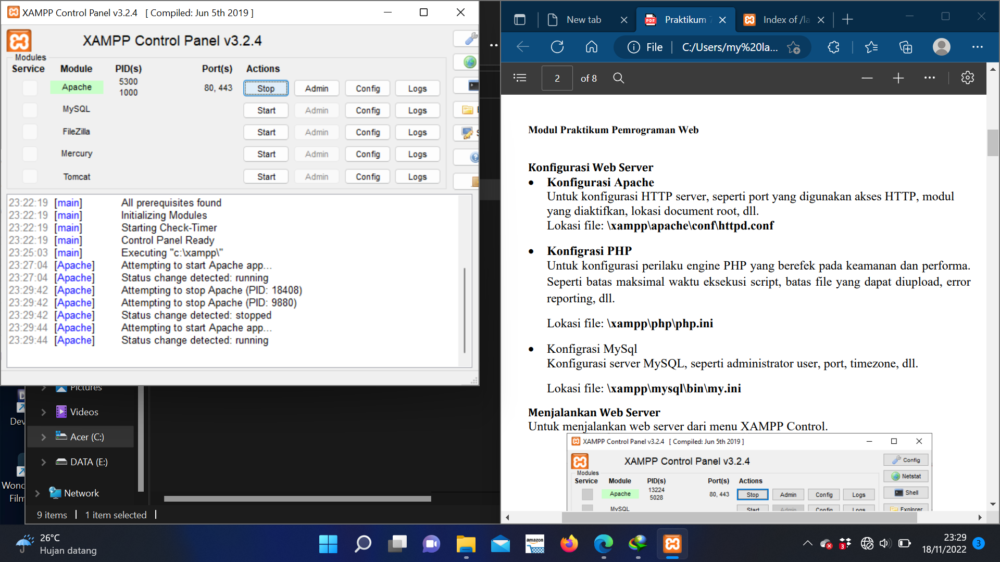

### Memulai PHP
Buat folder lab7_php_dasar pada root directory web server (c:\xampp\htdocs)
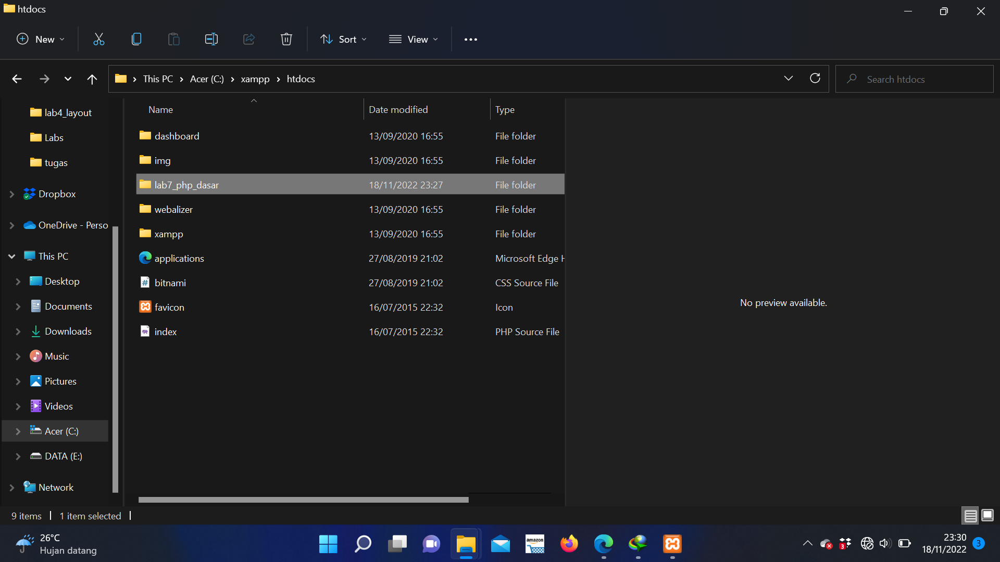

Kemudian untuk mengakses direktory tersebut pada web server dengan mengakses URL: http://localhost/lab7_php_dasar/
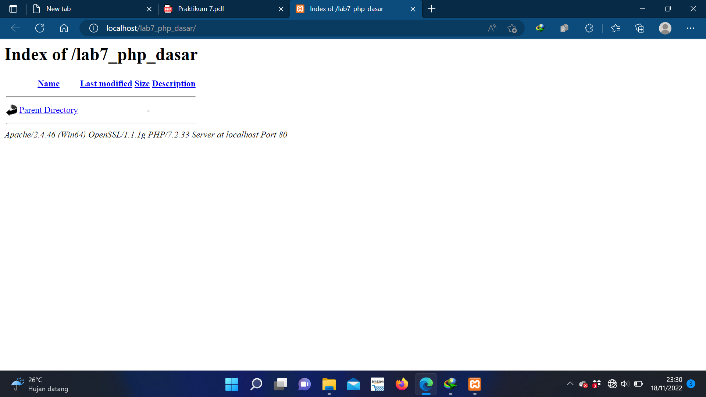

### PHP Dasar
Buat file baru dengan nama php_dasar.php pada directory tersebut. Kemudian buat kode seperti berikut. untuk mengakses hasilnya melalui URL: http://localhost/lab7_php_dasar/php_dasar.php
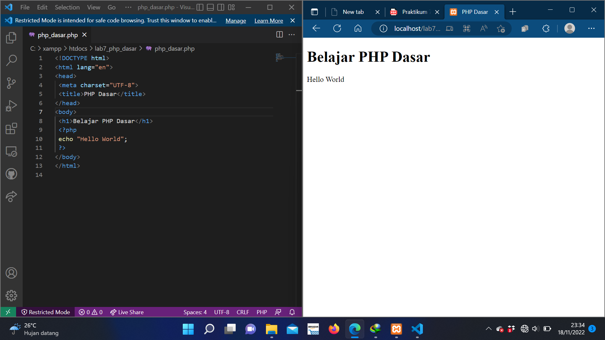

### Variable PHP
Menambahkan variable pada program.
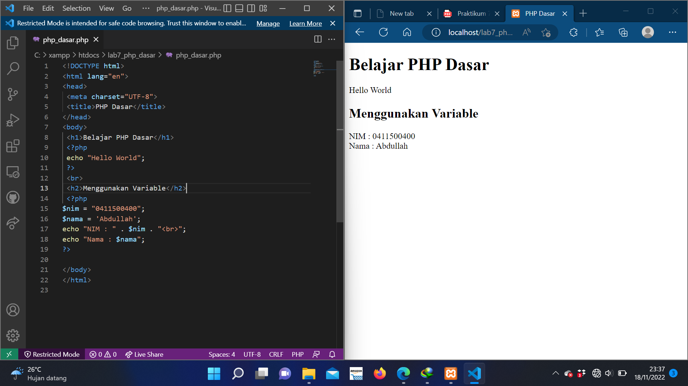

### Predefine Variable $_GET
Untuk mengaksesnya gunakan URL: http://localhost/lab7_php_dasar/predefine_variable.php?nama=Arif
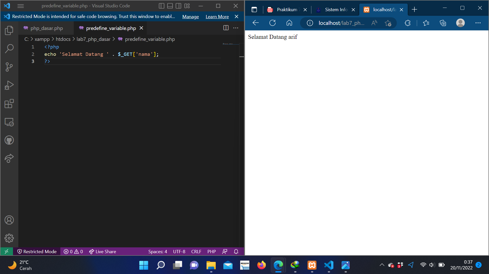

### Membuat Form Input
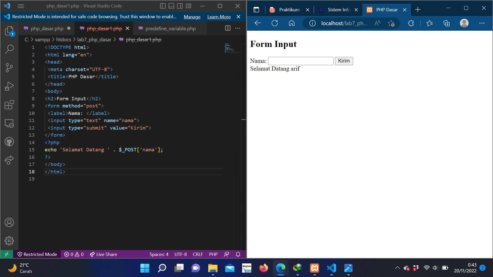

### Operator
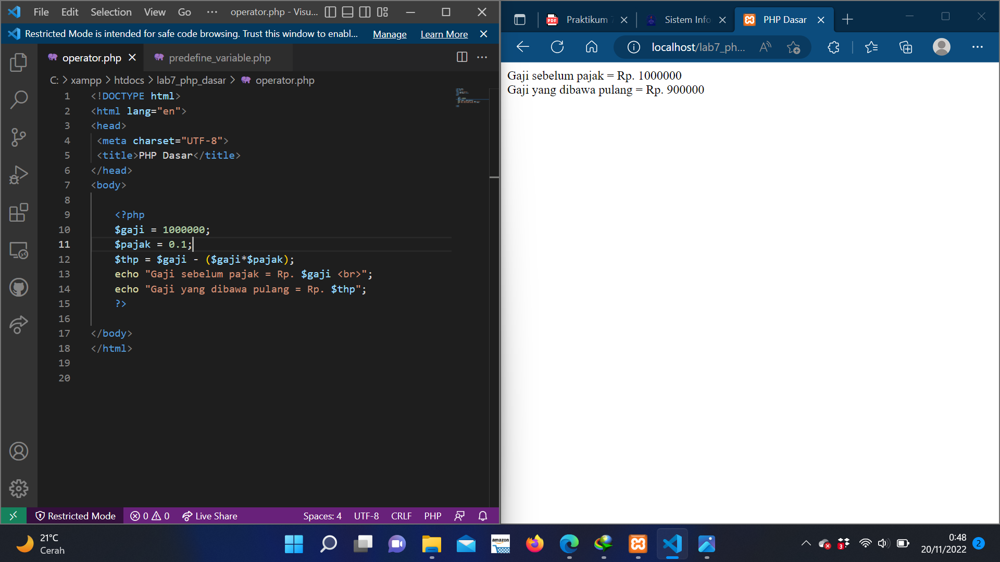

### Kondisi IF
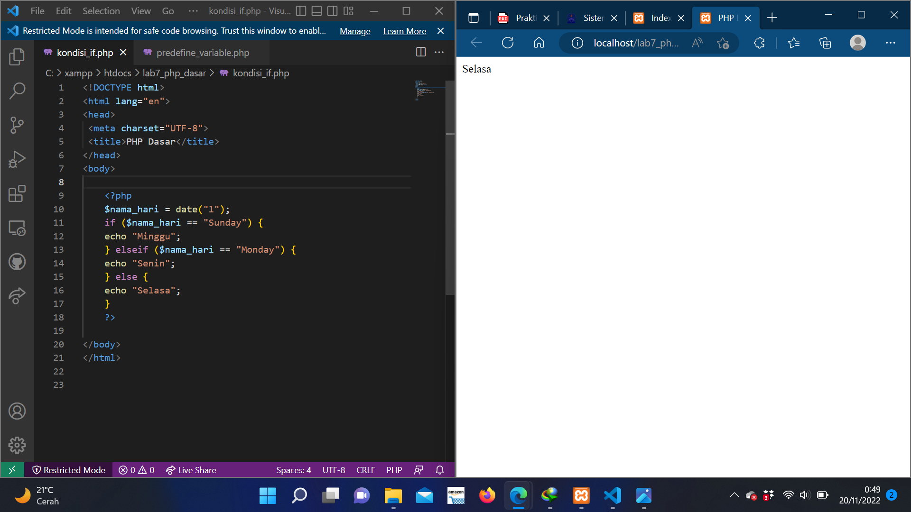

### Kondisi Switch
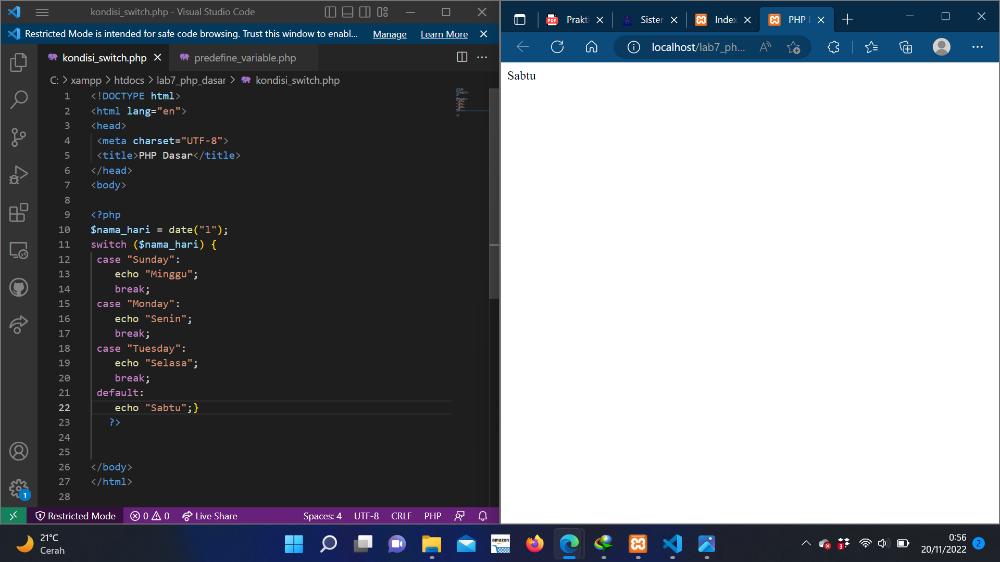

### Perulangan for
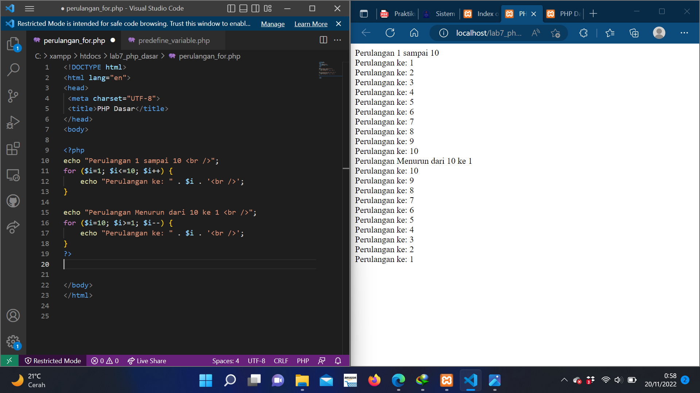

### Perulangan while
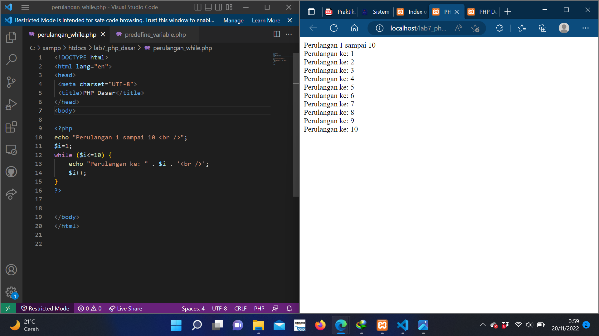

### Perulangan dowhile
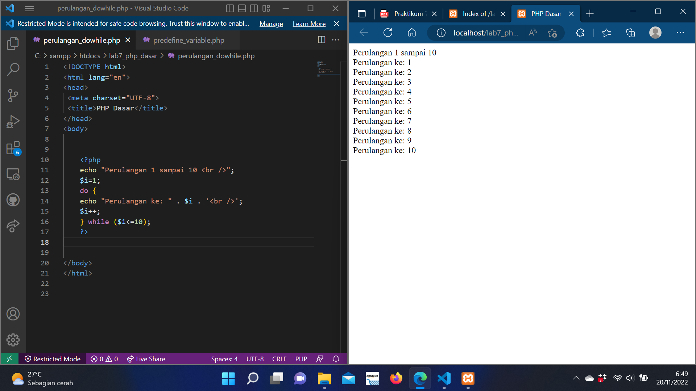